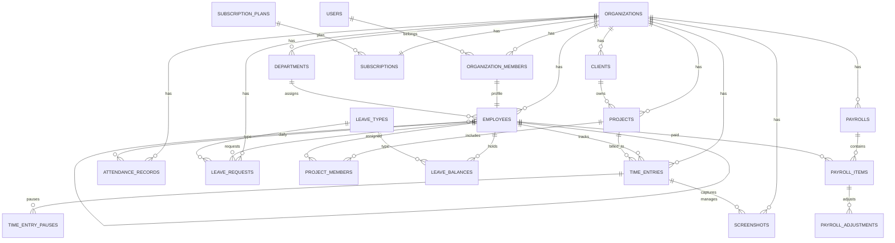

# Database Schema & ERD

## Design Decisions

| Decision | Choice | Rationale |
|----------|--------|-----------|
| Tenancy | Shared DB, `organization_id` FK | Fast MVP; index `(organization_id, …)` on all tenant tables |
| Auth | `users` + `organization_members` | One login, multiple org memberships (future) |
| RBAC | Spatie Permission + `team_id = organization_id` | Battle-tested Laravel RBAC |
| Employee data | `employees` extends membership | Separates HR/payroll fields from auth |
| Active timers | Redis + `time_entries` row | Sub-second start/stop; DB is source of truth |
| Screenshots | S3 + `screenshots` metadata | Cheap storage at scale; DB stores paths only |
| Payroll | Period-based `payrolls` + line `payroll_items` | Supports adjustments, bonuses, deductions |

---

## Complete Schema

### Platform (no tenant scope)

```sql
-- subscription_plans
id                  BIGINT UNSIGNED PK
name                VARCHAR(100)          -- Starter, Growth, Enterprise
slug                VARCHAR(50) UNIQUE
max_employees       INT UNSIGNED
max_projects        INT UNSIGNED
screenshot_enabled  BOOLEAN DEFAULT TRUE
screenshot_interval INT UNSIGNED          -- seconds, min 60
price_monthly       DECIMAL(10,2)
price_yearly        DECIMAL(10,2)
features            JSON                  -- feature flags
is_active           BOOLEAN DEFAULT TRUE
created_at, updated_at

-- organizations (tenants)
id                  BIGINT UNSIGNED PK
uuid                CHAR(36) UNIQUE
name                VARCHAR(255)
slug                VARCHAR(100) UNIQUE     -- subdomain: {slug}.agencypulse.app
logo_path           VARCHAR(500) NULL
timezone            VARCHAR(64) DEFAULT 'UTC'
currency            CHAR(3) DEFAULT 'USD'
work_week_start     TINYINT DEFAULT 1       -- 1=Mon
standard_hours_day  DECIMAL(4,2) DEFAULT 8
late_threshold_min  INT DEFAULT 15
screenshot_interval INT DEFAULT 600         -- 10 min
screenshot_enabled  BOOLEAN DEFAULT TRUE
status              ENUM('active','suspended','trial') DEFAULT 'trial'
trial_ends_at       TIMESTAMP NULL
created_at, updated_at, deleted_at

-- subscriptions
id                  BIGINT UNSIGNED PK
organization_id     BIGINT UNSIGNED FK → organizations
subscription_plan_id BIGINT UNSIGNED FK → subscription_plans
status              ENUM('active','past_due','cancelled','trialing')
billing_cycle       ENUM('monthly','yearly')
current_period_start TIMESTAMP
current_period_end   TIMESTAMP
stripe_subscription_id VARCHAR(255) NULL
created_at, updated_at
```

### Auth & Membership

```sql
-- users
id                  BIGINT UNSIGNED PK
uuid                CHAR(36) UNIQUE
name                VARCHAR(255)
email               VARCHAR(255) UNIQUE
email_verified_at   TIMESTAMP NULL
password            VARCHAR(255)
avatar_path         VARCHAR(500) NULL
is_super_admin      BOOLEAN DEFAULT FALSE
last_seen_at        TIMESTAMP NULL
created_at, updated_at, deleted_at

-- organization_members (login ↔ org ↔ role)
id                  BIGINT UNSIGNED PK
organization_id     BIGINT UNSIGNED FK → organizations
user_id             BIGINT UNSIGNED FK → users
role                ENUM('org_admin','manager','employee')
status              ENUM('active','invited','suspended') DEFAULT 'invited'
invited_at          TIMESTAMP NULL
joined_at           TIMESTAMP NULL
created_at, updated_at
UNIQUE (organization_id, user_id)

-- Spatie: roles, permissions, model_has_roles, etc.
-- team_foreign_key = organization_id
```

### HR — Employees & Departments

```sql
-- departments
id                  BIGINT UNSIGNED PK
organization_id     BIGINT UNSIGNED FK
name                VARCHAR(255)
description         TEXT NULL
manager_id          BIGINT UNSIGNED NULL FK → employees
is_active           BOOLEAN DEFAULT TRUE
created_at, updated_at, deleted_at
INDEX (organization_id, is_active)

-- employees
id                  BIGINT UNSIGNED PK
organization_id     BIGINT UNSIGNED FK
organization_member_id BIGINT UNSIGNED FK → organization_members UNIQUE
department_id       BIGINT UNSIGNED NULL FK → departments
employee_code       VARCHAR(50)             -- EMP-001
manager_id          BIGINT UNSIGNED NULL FK → employees
job_title           VARCHAR(255) NULL
salary_type         ENUM('hourly','fixed') DEFAULT 'hourly'
hourly_rate         DECIMAL(10,2) NULL
monthly_salary      DECIMAL(12,2) NULL
currency            CHAR(3) DEFAULT 'USD'
hire_date           DATE NULL
work_schedule       JSON NULL               -- { "mon": 8, "tue": 8, ... }
status              ENUM('active','inactive','terminated') DEFAULT 'active'
created_at, updated_at, deleted_at
INDEX (organization_id, status)
INDEX (organization_id, department_id)
```

### Clients & Projects

```sql
-- clients
id                  BIGINT UNSIGNED PK
organization_id     BIGINT UNSIGNED FK
name                VARCHAR(255)
email               VARCHAR(255) NULL
phone               VARCHAR(50) NULL
company             VARCHAR(255) NULL
address             TEXT NULL
billing_rate        DECIMAL(10,2) NULL      -- default client bill rate
status              ENUM('active','inactive') DEFAULT 'active'
notes               TEXT NULL
created_at, updated_at, deleted_at
INDEX (organization_id, status)

-- projects
id                  BIGINT UNSIGNED PK
organization_id     BIGINT UNSIGNED FK
client_id           BIGINT UNSIGNED FK → clients
name                VARCHAR(255)
description         TEXT NULL
budget_hours        DECIMAL(10,2) NULL
hourly_rate         DECIMAL(10,2) NULL      -- billable rate override
status              ENUM('active','on_hold','completed','archived') DEFAULT 'active'
start_date          DATE NULL
end_date            DATE NULL
color               CHAR(7) DEFAULT '#3B82F6'
created_at, updated_at, deleted_at
INDEX (organization_id, client_id, status)

-- project_members
id                  BIGINT UNSIGNED PK
project_id          BIGINT UNSIGNED FK → projects
employee_id         BIGINT UNSIGNED FK → employees
role                ENUM('lead','member') DEFAULT 'member'
assigned_at         TIMESTAMP
created_at, updated_at
UNIQUE (project_id, employee_id)
```

### Time Tracking

> **Payroll rule:** Only rows with `status = 'approved'` count toward salary, attendance, and reports.  
> Automatic entries auto-approve on stop. Manual entries require manager approval.

```sql
-- time_entries
id                  BIGINT UNSIGNED PK
organization_id     BIGINT UNSIGNED FK
employee_id         BIGINT UNSIGNED FK → employees
project_id          BIGINT UNSIGNED NULL FK → projects  -- required for manual
task_name           VARCHAR(255) NULL                   -- optional task label
type                ENUM('automatic','manual') DEFAULT 'automatic'
status              ENUM('running','paused','pending','approved','rejected') DEFAULT 'running'
start_time          TIMESTAMP
end_time            TIMESTAMP NULL
duration_seconds    INT UNSIGNED DEFAULT 0  -- computed on stop/submit
paused_seconds      INT UNSIGNED DEFAULT 0
activity_percentage TINYINT UNSIGNED NULL   -- 0-100 from desktop agent
notes               TEXT NULL
manual_reason       TEXT NULL               -- REQUIRED when type=manual
approval_comment    TEXT NULL               -- manager comment on approve/reject
approved_by         BIGINT UNSIGNED NULL FK → users
approved_at         TIMESTAMP NULL
created_at, updated_at
INDEX (organization_id, employee_id, start_time)
INDEX (organization_id, employee_id, status, start_time)
INDEX (organization_id, project_id, start_time)
INDEX (organization_id, status, type)       -- approval queue hot path

-- time_entry_pauses
id                  BIGINT UNSIGNED PK
time_entry_id       BIGINT UNSIGNED FK → time_entries
paused_at           TIMESTAMP
resumed_at          TIMESTAMP NULL
duration_seconds    INT UNSIGNED DEFAULT 0
created_at, updated_at
```

### Screenshots

```sql
-- screenshots
id                  BIGINT UNSIGNED PK
organization_id     BIGINT UNSIGNED FK
employee_id         BIGINT UNSIGNED FK → employees
time_entry_id       BIGINT UNSIGNED NULL FK → time_entries
storage_disk        VARCHAR(50) DEFAULT 's3'
image_path          VARCHAR(500)            -- org/{org_id}/screenshots/...
thumbnail_path      VARCHAR(500) NULL
file_size_bytes     INT UNSIGNED
captured_at         TIMESTAMP
activity_percentage TINYINT UNSIGNED NULL
is_flagged          BOOLEAN DEFAULT FALSE
reviewed_by         BIGINT UNSIGNED NULL FK → users
reviewed_at         TIMESTAMP NULL
created_at, updated_at
INDEX (organization_id, employee_id, captured_at)
INDEX (organization_id, captured_at)
```

### Attendance

```sql
-- attendance_records
id                  BIGINT UNSIGNED PK
organization_id     BIGINT UNSIGNED FK
employee_id         BIGINT UNSIGNED FK → employees
date                DATE
status              ENUM('present','absent','late','half_day','leave','holiday')
worked_hours        DECIMAL(5,2) DEFAULT 0
expected_hours      DECIMAL(5,2) DEFAULT 8
first_clock_in      TIMESTAMP NULL
last_clock_out      TIMESTAMP NULL
is_auto_generated   BOOLEAN DEFAULT TRUE
notes               TEXT NULL
created_at, updated_at
UNIQUE (organization_id, employee_id, date)
INDEX (organization_id, date, status)
```

### Leave Management

```sql
-- leave_types
id                  BIGINT UNSIGNED PK
organization_id     BIGINT UNSIGNED FK
name                VARCHAR(100)            -- Annual, Sick, Unpaid
code                VARCHAR(20)
default_days        DECIMAL(5,1) DEFAULT 0
is_paid             BOOLEAN DEFAULT TRUE
is_active           BOOLEAN DEFAULT TRUE
created_at, updated_at

-- leave_balances
id                  BIGINT UNSIGNED PK
organization_id     BIGINT UNSIGNED FK
employee_id         BIGINT UNSIGNED FK → employees
leave_type_id       BIGINT UNSIGNED FK → leave_types
year                SMALLINT
allocated_days      DECIMAL(5,1)
used_days           DECIMAL(5,1) DEFAULT 0
pending_days        DECIMAL(5,1) DEFAULT 0
carried_over        DECIMAL(5,1) DEFAULT 0
created_at, updated_at
UNIQUE (organization_id, employee_id, leave_type_id, year)

-- leave_requests
id                  BIGINT UNSIGNED PK
organization_id     BIGINT UNSIGNED FK
employee_id         BIGINT UNSIGNED FK → employees
leave_type_id       BIGINT UNSIGNED FK → leave_types
start_date          DATE
end_date            DATE
total_days          DECIMAL(5,1)
reason              TEXT NULL
status              ENUM('pending','approved','rejected','cancelled') DEFAULT 'pending'
reviewed_by         BIGINT UNSIGNED NULL FK → users
reviewed_at         TIMESTAMP NULL
review_notes        TEXT NULL
created_at, updated_at
INDEX (organization_id, employee_id, status)
INDEX (organization_id, status, start_date)
```

### Payroll

```sql
-- payrolls (pay period header)
id                  BIGINT UNSIGNED PK
organization_id     BIGINT UNSIGNED FK
period_start        DATE
period_end          DATE
status              ENUM('draft','processing','approved','paid') DEFAULT 'draft'
total_gross         DECIMAL(14,2) DEFAULT 0
total_deductions    DECIMAL(14,2) DEFAULT 0
total_net           DECIMAL(14,2) DEFAULT 0
generated_by        BIGINT UNSIGNED FK → users
approved_by         BIGINT UNSIGNED NULL FK → users
approved_at         TIMESTAMP NULL
paid_at             TIMESTAMP NULL
notes               TEXT NULL
created_at, updated_at
UNIQUE (organization_id, period_start, period_end)

-- payroll_items (per employee)
id                  BIGINT UNSIGNED PK
payroll_id          BIGINT UNSIGNED FK → payrolls
employee_id         BIGINT UNSIGNED FK → employees
salary_type         ENUM('hourly','fixed')
base_hours          DECIMAL(8,2) DEFAULT 0
approved_hours      DECIMAL(8,2) DEFAULT 0
hourly_rate         DECIMAL(10,2) NULL
monthly_salary      DECIMAL(12,2) NULL
gross_pay           DECIMAL(12,2)
total_bonuses       DECIMAL(12,2) DEFAULT 0
total_deductions    DECIMAL(12,2) DEFAULT 0
net_pay             DECIMAL(12,2)
pdf_path            VARCHAR(500) NULL
created_at, updated_at
UNIQUE (payroll_id, employee_id)

-- payroll_adjustments (bonuses & deductions line items)
id                  BIGINT UNSIGNED PK
payroll_item_id     BIGINT UNSIGNED FK → payroll_items
type                ENUM('bonus','deduction')
label               VARCHAR(255)            -- Performance Bonus, Tax, Advance
amount              DECIMAL(12,2)
notes               TEXT NULL
created_at, updated_at
```

### Audit & Settings

```sql
-- audit_logs
id                  BIGINT UNSIGNED PK
organization_id     BIGINT UNSIGNED NULL
user_id             BIGINT UNSIGNED NULL FK → users
auditable_type      VARCHAR(255)
auditable_id        BIGINT UNSIGNED
event               VARCHAR(50)             -- created, approved, paid
old_values          JSON NULL
new_values          JSON NULL
ip_address          VARCHAR(45) NULL
created_at
INDEX (organization_id, auditable_type, auditable_id)

-- organization_settings (key-value extensibility)
id, organization_id, key, value (JSON), created_at, updated_at
UNIQUE (organization_id, key)
```

---

## ERD



### Relationship Summary

| Parent | Child | Cardinality | Notes |
|--------|-------|-------------|-------|
| Organization | All tenant entities | 1:N | Cascade soft-delete policy per entity |
| User | OrganizationMember | 1:N | Multi-org future-ready |
| OrganizationMember | Employee | 1:1 | HR record only for employee roles |
| Employee | TimeEntry | 1:N | Indexed by date range |
| TimeEntry | Screenshot | 1:N | Optional link |
| Employee | AttendanceRecord | 1:N | One per day per employee |
| Payroll | PayrollItem | 1:N | Immutable after `approved` |

---

## Indexing Strategy (10k+ employees)

```sql
-- Hot query patterns
CREATE INDEX idx_te_org_emp_date ON time_entries (organization_id, employee_id, start_time DESC);
CREATE INDEX idx_att_org_date ON attendance_records (organization_id, date, status);
CREATE INDEX idx_ss_org_captured ON screenshots (organization_id, captured_at DESC);
CREATE INDEX idx_lr_org_status ON leave_requests (organization_id, status, start_date);

-- Partitioning (Phase 2): screenshots & time_entries by month
-- ALTER TABLE screenshots PARTITION BY RANGE (TO_DAYS(captured_at));
```

---

## Redis Keys

| Key Pattern | TTL | Purpose |
|-------------|-----|---------|
| `org:{id}:timer:{employee_id}` | 24h | Active timer JSON |
| `org:{id}:online` | 5m | Set of online employee IDs |
| `org:{id}:screenshot:due:{employee_id}` | interval | Next capture timestamp |
| `user:{id}:current_org` | 30d | Selected org context |
