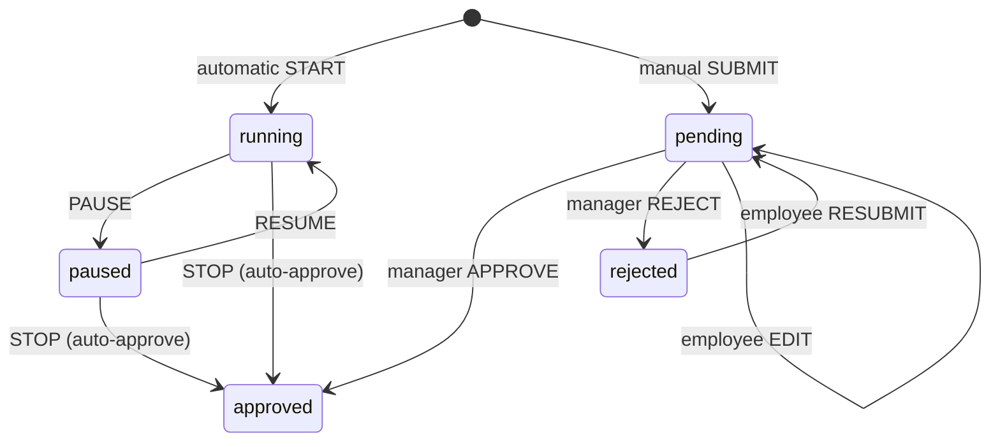

# Manual Time Entry System — Design Specification

> **Business rule:** Only `status = approved` entries count toward payroll, attendance, and reports.  
> **Canonical rules:** See [domain-rules.md](./domain-rules.md) — supersedes this doc on conflict.

---

## State Machine



---

## `time_entries` Schema (canonical)

```sql
time_entries
├── id
├── organization_id          FK
├── employee_id              FK
├── project_id               FK (required for manual; optional for automatic)
├── task_name                VARCHAR(255) NULL
├── type                     ENUM('automatic','manual')
├── status                   ENUM('running','paused','pending','approved','rejected')
├── start_time               TIMESTAMP
├── end_time                 TIMESTAMP NULL
├── duration_seconds         INT UNSIGNED DEFAULT 0
├── paused_seconds           INT UNSIGNED DEFAULT 0
├── activity_percentage      TINYINT UNSIGNED NULL
├── notes                    TEXT NULL
├── manual_reason            TEXT NULL          -- REQUIRED when type=manual
├── approval_comment         TEXT NULL          -- set on approve/reject
├── approved_by              FK users NULL
├── approved_at              TIMESTAMP NULL
├── created_at, updated_at

INDEX (organization_id, employee_id, status, start_time)
INDEX (organization_id, status, type)            -- approval queue
```

### Status Rules

| type | status | Payroll? | Attendance? | Editable by employee? |
|------|--------|:--------:|:-------------:|:---------------------:|
| automatic | running | ❌ | ❌ | — |
| automatic | paused | ❌ | ❌ | — |
| automatic | approved | ✅ | ✅ | ❌ |
| manual | pending | ❌ | ❌ | ✅ |
| manual | approved | ✅ | ✅ | ❌ |
| manual | rejected | ❌ | ❌ | ✅ (resubmit) |

---

## Service: `ManualTimeEntryService`

```php
class ManualTimeEntryService
{
    public function submit(Employee $employee, ManualEntryData $data): TimeEntry;
    public function update(TimeEntry $entry, ManualEntryData $data): TimeEntry;  // pending/rejected only
    public function approve(TimeEntry $entry, User $reviewer, ?string $comment): TimeEntry;
    public function reject(TimeEntry $entry, User $reviewer, string $comment): TimeEntry;
    public function resubmit(TimeEntry $entry, ManualEntryData $data): TimeEntry;
}
```

### Validation on Submit
- `manual_reason` min 10 characters
- `project_id` required; employee must be `project_members`
- `end_time > start_time`; max 12h per entry (configurable)
- No overlap with other **approved** or **pending** entries for same employee
- Future dates blocked

### On Approve
1. Set `status = approved`, `approved_by`, `approved_at`
2. Dispatch `ManualTimeEntryApproved` event
3. Queue `RecalculateAttendanceForDate` for entry date(s)
4. Notify employee

### On Reject
1. `approval_comment` required (min 5 chars)
2. `status = rejected`
3. Notify employee with comment

---

## Payroll Integration

```php
// PayrollCalculatorService
$approvedSeconds = $this->timeEntryRepository->sumApprovedDuration(
    employeeId: $employee->id,
    from: $periodStart,
    to: $periodEnd,
);
// Query: WHERE status = 'approved' AND start_time BETWEEN ...
```

**Never** use `completed`, `pending`, or `running` in payroll math.

---

## Approval Queue API

| Method | Endpoint | Role |
|--------|----------|------|
| GET | `/time-entries/pending-approval` | manager, org_admin |
| POST | `/time-entries/manual` | employee |
| PATCH | `/time-entries/{id}/manual` | employee (own, pending/rejected) |
| PATCH | `/time-entries/{id}/approve` | manager, org_admin |
| PATCH | `/time-entries/{id}/reject` | manager, org_admin |

Filters: `employee_id`, `project_id`, `from`, `to`, `type=manual`

---

## UI Surfaces

1. **Employee:** "Add Manual Entry" dialog on timesheet page; status badges on each row
2. **Manager:** "Pending Approvals" inbox (sidebar badge count)
3. **Admin dashboard:** KPI card "Pending Manual Entries: N"
4. **Reports:** "Manual vs Automatic Hours" stacked bar chart

---

## Fraud Prevention

| Control | Implementation |
|---------|----------------|
| Mandatory reason | Server validation |
| Manager approval | RBAC + team scope |
| Overlap detection | Service layer check |
| Audit trail | `audit_logs` on approve/reject |
| Max daily manual hours | Org setting (default 2h without flag) |
| Approved immutability | Policy blocks edit; admin override logged |

---

## Notifications (queued)

| Event | Recipient |
|-------|-----------|
| Manual submitted | Employee's manager |
| Approved | Employee |
| Rejected | Employee (includes comment) |
